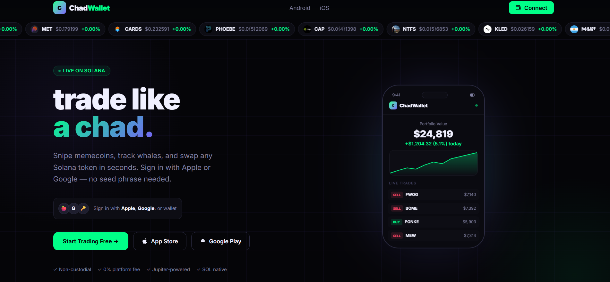
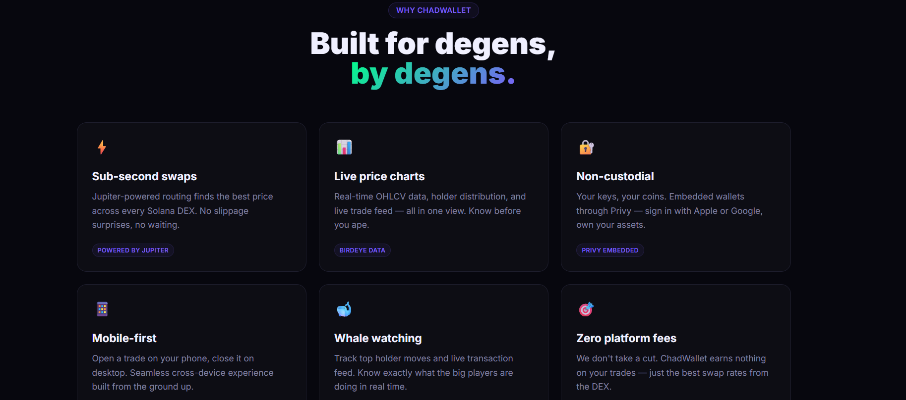
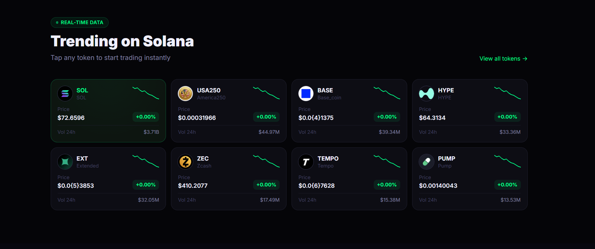
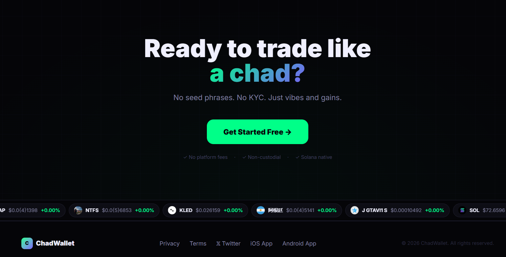

# ChadWallet — Landing Page

> fomo.family-style Solana trading landing page — built as the ChadWallet founding engineer screening task.







---

## Architecture

```
Browser (Next.js App Router)
├── Navbar              ← Privy auth state, connect button
├── TokenBanner         ← Scrolling live token ticker (top + bottom)
├── LandingClient       ← Hero, stats, trending grid, features, CTAs
└── PrivyProvider       ← Auth context wrapper

Next.js Server (Vercel)
├── app/page.tsx        ← Server component, fetches BirdEye trending (ISR 30s)
└── app/layout.tsx      ← Root shell, mounts Privy + Navbar

lib/
├── birdeye.ts          ← Trending tokens, OHLCV, trades, holders
├── jupiter.ts          ← Quote + swap transaction helpers (ready for trading page)
└── utils.ts            ← Price/volume/address formatters

External APIs
├── BirdEye             ← Real-time Solana token data
├── Privy               ← Apple / Google / wallet / email auth + embedded wallets
├── Jupiter             ← DEX aggregator swap routing (no key needed)
└── Alchemy RPC         ← Solana mainnet RPC

Solana Blockchain
└── Mainnet · SPL tokens · DEX programs (Raydium, Orca, Meteora…)
```

---

## Folder structure

```
chadwallet/
├── app/
│   ├── globals.css          # Brand theme (dark, green/purple palette)
│   ├── layout.tsx           # Root layout — Privy + Navbar
│   ├── page.tsx             # Landing page server component
│   └── trade/
│       └── page.tsx         # Trading page stub (redirect)
│
├── components/
│   ├── LandingClient.tsx    # Full landing page UI (hero, grid, features, CTAs)
│   ├── Navbar.tsx           # Fixed top nav with Privy connect button
│   ├── PrivyProvider.tsx    # Privy config wrapper
│   └── TokenBanner.tsx      # Animated scrolling token ticker
│
├── lib/
│   ├── birdeye.ts           # BirdEye API calls + fallback tokens
│   ├── jupiter.ts           # Jupiter quote + swap helpers
│   └── utils.ts             # formatPrice, formatVolume, shortenAddress…
│
├── public/
│   └── assets/              # ← Place brand logos/icons here
│
├── docs/
│   └── screenshots/         # ← Place screenshots here (see below)
│
├── .env.local.example       # Environment variable template
├── vercel.json              # Vercel deployment config
└── README.md
```

---

## Screenshots

Place screenshots in `docs/screenshots/` and they'll render above.

| File | What to capture |
|------|----------------|
| `docs/screenshots/hero.png` | Full hero section with phone mockup and token banner |
| `docs/screenshots/trending.png` | Trending tokens grid with live BirdEye data |
| `docs/screenshots/connect.png` | Privy connect modal (Apple/Google/wallet options) |
| `docs/screenshots/features.png` | Features section |
| `docs/screenshots/mobile.png` | Mobile viewport (375px width) |

To take a screenshot at exact width in Chrome: DevTools → Toggle device toolbar → set to 1440×900 → Cmd+Shift+P → "Capture screenshot".

---

## How to run locally

### Prerequisites

- Node.js 18+
- npm 9+

### 1. Clone and install

```bash
git clone https://github.com/your-username/chadwallet.git
cd chadwallet
npm install
```

### 2. Set up environment variables

```bash
cp .env.local.example .env.local
```

Open `.env.local` and fill in:

```env
NEXT_PUBLIC_PRIVY_APP_ID=      # dashboard.privy.io → create app → copy ID
NEXT_PUBLIC_BIRDEYE_API_KEY=   # birdeye.so/data-api → Security → copy key
NEXT_PUBLIC_ALCHEMY_RPC_URL=   # alchemy.com → Solana mainnet app → HTTP URL
```

> The app works without keys — it falls back to 8 hardcoded tokens and shows an alert on Connect.

### 3. Start dev server

```bash
npm run dev
```

Open [http://localhost:3000](http://localhost:3000)

### 4. Build for production

```bash
npm run build
npm start
```

---

## How to deploy to Vercel

```bash
npx vercel
```

Then add env vars in the Vercel dashboard:

**Project → Settings → Environment Variables**

| Name | Value |
|------|-------|
| `NEXT_PUBLIC_PRIVY_APP_ID` | your Privy app ID |
| `NEXT_PUBLIC_BIRDEYE_API_KEY` | your BirdEye key |
| `NEXT_PUBLIC_ALCHEMY_RPC_URL` | your Alchemy Solana URL |

Then redeploy:

```bash
npx vercel --prod
```

---

## API keys — where to get them

| Service | URL | Free tier |
|---------|-----|-----------|
| Privy | [dashboard.privy.io](https://dashboard.privy.io) | ✅ Free |
| BirdEye | [birdeye.so/data-api](https://birdeye.so/data-api) → Security | 30K compute units/month |
| Alchemy | [alchemy.com](https://alchemy.com) → Solana mainnet | 300M compute units/month |
| Jupiter | No key needed — open API | ✅ Always free |

---

## What's built

### Landing page
- Top + bottom animated token banners (live BirdEye data, tapping opens trading page)
- Hero with animated phone mockup and live trade feed
- Stats strip ($2.1B volume, 180K traders, <0.5s swaps, 0% fees)
- Trending tokens grid with sparklines and real price data
- Features section (6 cards)
- "How it works" 3-step guide
- Leaderboard teaser with iOS + Android download CTAs
- Final CTA section
- Fully responsive (mobile + desktop)

### Auth (Privy)
- Sign in with Apple, Google, email, or existing Solana wallet
- Embedded Solana wallet auto-created for new users (no seed phrase)
- Connected state shows shortened wallet address in navbar

### Data
- BirdEye trending endpoint powers banners + grid (ISR revalidated every 30s)
- Graceful fallback to 8 hardcoded tokens when API key is absent

### Ready for trading page
All data utilities are pre-written in `lib/birdeye.ts` and `lib/jupiter.ts`:
- `getTrendingTokens()` — token list with prices + volumes
- `getOHLCV()` — candlestick data for charts
- `getTokenTrades()` — live trade feed
- `getTokenHolders()` — holder distribution
- `getQuote()` + `getSwapTransaction()` — Jupiter swap flow

---

## Tech stack

| Layer | Technology |
|-------|-----------|
| Framework | Next.js 16 (App Router, TypeScript) |
| Styling | Tailwind CSS v4 |
| Animation | Framer Motion (phone mockup) |
| Auth | Privy (embedded Solana wallets) |
| Token data | BirdEye API |
| Swaps | Jupiter Aggregator v6 |
| RPC | Alchemy Solana mainnet |
| Deployment | Vercel |

---

## Adding brand assets

Drop files from the Google Drive folder into `public/assets/`:

```
public/assets/
├── logo.png          # Used in Privy modal appearance
├── logo-dark.svg     # Navbar logo (optional)
└── icon.png          # Favicon (copy to app/favicon.ico)
```

Then update `components/Navbar.tsx` to use `<Image src="/assets/logo.png" />` instead of the letter "C" placeholder.
